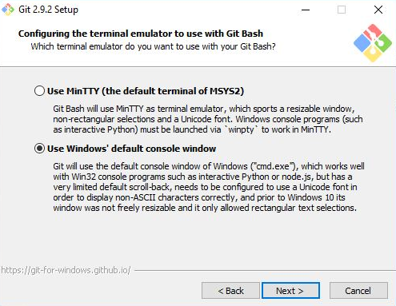

# Reworking Horiseon Website to Meet Accessibility Standards

## DESCRIPTION

I was motivated to build this project because I wanted to make the coding more organized and easier on the eyes. Also, it helps me practice my coding and helps me to understand it better. If the code was kept the same as before, it would be a lot harder for those who do not understand code to find things. I created this project to help make the index.html and style.css more legible for others and make finding code easier. By organizing how the code is written and compressing it so all similar code is bundled together, it becomes easier to read and understand. By doing this, I learned how to compress code so that I do not have repetitive code taking up so much space. Also, I learned how to use the element selector to organize the code. My project stands out because I tried to identify every selector so you can see what each section is, instead of just seeing "div" everywhere.

## INSTALLATION

For installation with Windows, you can install GitBash (https://gitforwindows.org/).
- Once downloaded, follow the prompt to install.
- When this prompt shows up, make sure to select "Checkout as-is, commit Unix-style line endings"   
    
- Then select, "Use Windows' default console window"
     

For MacOS, you would need to open your terminal and install Homebrew (https://brew.sh/).
- Open terminal and type "/bin/bash -c "$(curl -fsSL https://raw.githubusercontent.com/Homebrew/install/HEAD/install.sh)"

Next, create a GitHub account at (http://github.com)

Once created, open your terminal and create your ssh key.
- First, type "ls -al ~/.ssh" to see if you have any existing keys already installed.
- If you see an existing SSH key like, "id_rsa.pub or id_rsa" then you do not have to generate a new key.
- To generate a SSH key, open your terminal and type "ssh-keygen -t ed25519 -C "your_email@example.com"" (Remember to replace the email used in quotations)
    
It will ask you where to save the file, you can hit 'Enter' to save it in the current location. Then will ask for a passphrase, you can leave it empty for no passphrase, or enter a passphrase for a more secure login.

Next, for MacOS, type "open ~/.ssh/config" to see if you have a config file that will auto log you in. If you do not, you can create one by typing "touch ~/.ssh/config". Then retype "open ~/.ssh/config" to open the text editor. 

For Windows, type "notepad ~/.ssh/config". It will open a notepad for you to input text.

Enter the following lines. Then save your file.

    Host *
    IgnoreUnknown UseKeychain
    AddKeysToAgent yes
    UseKeychain yes
    IdentityFile ~/.ssh/id_ed25519

Once finished, type "ssh-add ~/.ssh/id_ed25519" to add your sshkey to your ssh-agent.

Finally, you need to copy your sshkey to the clipboard.
- For Windows, type "clip<>~/.ssh/id_ed25519.pub".
- For MacOS, type "pbcopy<>~/.ssh/id_ed25519.pub".

It is IMPORTANT you copy your public id (.pub) and not your private key.

Now you can add this to your GitHub account. Login to your GitHub account, then click on your profile picture, click "Settings", then click "SSH and GPG keys". Click "New SSH Key" then add a title (This should be the name of the device you are using) and finally paste your PUBLIC KEY in the Key field.

After doing all of this, you can now clone this repository by type "git clone git@github.com:rapostoljr/challenge_1_reworking_website.git"

This will clone the file for you personal use.

To view live page, open your browser (preferably Google Chrome), then enter "https://rapostoljr.github.io/challenge_1_reworking_website" in your address bar.
